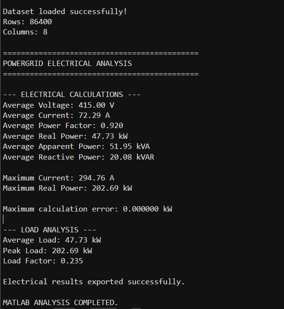
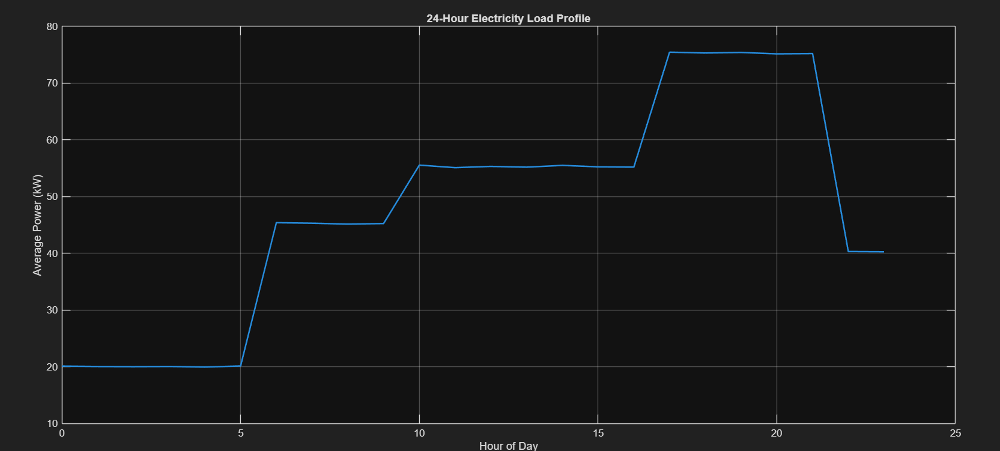
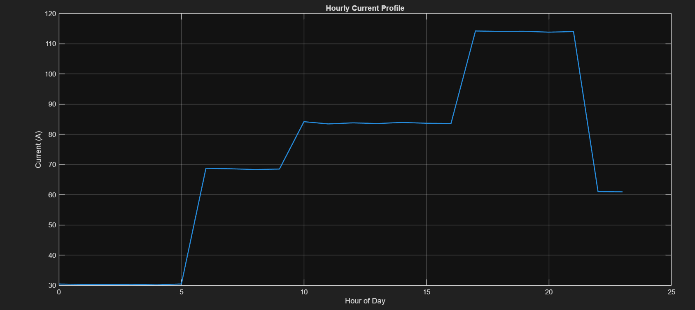
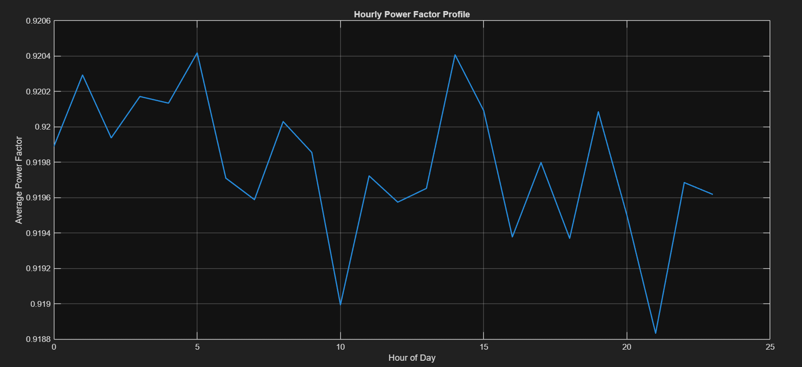
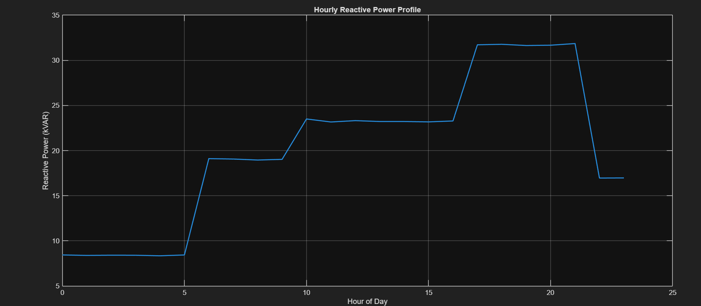

# ⚡ PowerGrid Energy Analytics & Electrical Operations Dashboard

An end-to-end electrical energy analytics project combining **Python, SQL, MATLAB and Power BI** to analyze energy consumption, electrical operating parameters, peak demand, meter performance and abnormal power events.

---

## 📌 Project Overview

This project analyzes **86,400 electrical measurements across 10 meters** and transforms raw electrical measurements into useful energy and grid-operation insights.

The project combines electrical engineering analysis with data analytics and business intelligence.

### Project Components

- 🐍 **Python** — Data generation, preprocessing, statistical analysis and anomaly detection
- 🗄️ **SQL / SQLite** — Energy, meter and peak-demand analytics
- ⚡ **MATLAB** — Electrical power calculations and validation
- 📊 **Power BI** — Interactive dashboard and visualization
- 🌐 **Python API** — Project data access through an API
- 🔧 **Git & GitHub** — Version control and project documentation

---

## 📊 Key Results

| Metric | Result |
|---|---:|
| Electrical Measurements | 86,400 |
| Monitored Meters | 10 |
| Total Energy | 1,030,988.61 kWh |
| Average Power | 47.73 kW |
| Peak Demand | 202.69 kW |
| Average Power Factor | 0.920 |
| Load Factor | 0.235 |
| Detected Anomalies | 157 |

---

## 🏗️ Project Architecture

```text
                 ELECTRICAL MEASUREMENT DATA
                           │
                           ▼
                    ┌─────────────┐
                    │   PYTHON    │
                    │             │
                    │ Data        │
                    │ Generation  │
                    │ Analysis    │
                    │ Anomalies   │
                    └──────┬──────┘
                           │
                           ▼
                    ┌─────────────┐
                    │   SQLite    │
                    │  Database   │
                    └──────┬──────┘
                           │
                 ┌─────────┴─────────┐
                 ▼                   ▼
          ┌─────────────┐     ┌─────────────┐
          │     SQL     │     │   MATLAB    │
          │  Analytics  │     │ Electrical  │
          │             │     │ Calculations│
          └──────┬──────┘     └──────┬──────┘
                 │                   │
                 └─────────┬─────────┘
                           ▼
                    ┌─────────────┐
                    │  POWER BI   │
                    │  Dashboard  │
                    └──────┬──────┘
                           │
                           ▼
                 GRID & OPERATIONAL
                       INSIGHTS
```
## 📊 Power BI Dashboard

The Power BI dashboard provides an interactive view of electrical energy consumption, demand, electrical operating parameters, meter performance, power quality and abnormal events.

1. Executive Energy Overview

Provides a high-level view of:

Total energy consumption
Average power
Peak demand
Load factor
Hourly load profile
Meter-level energy consumption
Peak operating periods

2. Electrical Operations

Analyzes important electrical operating parameters including:

Voltage
Current
Real power
Apparent power
Reactive power
Power factor
Electrical operating profiles

3. Anomaly & Power Quality

Provides analysis of abnormal electrical operating events including:

Total anomaly events
High-power events
Anomaly distribution by meter
Power versus power factor
High-consumption events
Power-quality indicators

4. Grid Insights & Recommendations

Summarizes operational findings including:

Peak demand
Load factor
Average power factor
Meter-level peak demand
High-power events
Recommended operational actions

## ⚡ MATLAB Electrical Engineering Analysis

MATLAB was used to perform electrical engineering calculations and validate the relationships between voltage, current, power factor and electrical power.

Electrical Parameters Analyzed
Voltage
Current
Real Power
Apparent Power
Reactive Power
Power Factor
Peak Demand
Load Factor
Three-Phase Power Calculations
Real Power
P = √3 × V × I × PF
Apparent Power
S = √3 × V × I
Reactive Power
Q = √(S² − P²)
Power Factor
PF = P / S

The calculated electrical power was validated against the recorded power values, producing a maximum calculation error of approximately 0 kW.

### MATLAB Results


### MATLAB Load Profile


### MATLAB Current Profile


### MATLAB Power factor Profile


### MATLAB Reactive power Profile




The MATLAB analysis produced the following results:

Parameter	Result
Average Voltage	415.00 V
Average Current	72.29 A
Average Power Factor	0.920
Average Real Power	47.73 kW
Average Apparent Power	51.95 kVA
Average Reactive Power	20.08 kVAR
Maximum Current	294.76 A
Maximum Real Power	202.69 kW
Load Factor	0.235
Maximum Calculation Error	~0 kW

MATLAB Load Profile

The hourly load profile was analyzed to understand variations in electrical demand throughout the day.

MATLAB Power Factor Profile

The hourly power factor profile was analyzed to observe changes in electrical operating conditions.

MATLAB Reactive Power Profile

Reactive power was analyzed to understand the reactive component of electrical demand.

MATLAB Current Profile

The current profile was analyzed to identify variations in electrical current demand.

## 🐍 Python Data Analysis

Python was used as the primary data-processing and analytics layer.

Python Tasks
Electrical dataset generation
Data preprocessing
Data-quality validation
Statistical analysis
Hourly load analysis
Meter-level analysis
Peak-demand analysis
Anomaly detection
Exporting analytical results
Data Quality

The dataset contains:

86,400 rows
8 columns
10 meters
No missing values
## 🚨 Anomaly Detection

A power-based analytical threshold was applied to identify abnormal high-power events.

Results
Anomaly threshold: approximately 109.93 kW
Total anomalies detected: 157
Maximum observed power: 202.69 kW

These events can be investigated for:

Equipment loading
Abnormal operating conditions
Peak-demand events
Meter-level operating behavior
Potential power-quality concerns
## 🗄️ SQL Analytics

SQL was used to perform structured analysis of the electrical dataset.

SQL Analysis Includes
Total Energy

Total recorded energy consumption:

1,030,988.61 kWh

Power Statistics
Average power: 47.73 kW
Peak demand: 202.69 kW
Meter Performance

Each meter was evaluated based on:

Total energy
Average power
Peak power
Average power factor
Peak-Hour Analysis

The highest average load occurred around:

17:00

The highest average-load period was concentrated approximately between:

17:00 and 21:00

High-Consumption Events

SQL was also used to identify the highest recorded power events and the meters associated with them.

## 🔌 Electrical Engineering Concepts Demonstrated

This project integrates several electrical engineering concepts:

Three-phase electrical power
Real power
Apparent power
Reactive power
Power factor
Voltage and current analysis
Peak demand
Load factor
Electrical load profiles
Power-quality analysis
Abnormal operating-event detection
## 📈 Key Findings
1. Peak Demand

The maximum recorded real power was:

202.69 kW

2. Average Electrical Load

The average real power was:

47.73 kW

3. Power Factor

The average power factor was:

0.920

This indicates that the system has a measurable reactive-power component that can be monitored as part of power-quality analysis.

4. Load Factor

The calculated load factor was:

0.235

This indicates significant variation between average operating load and peak demand.

5. Abnormal Events

The analysis detected:

157 high-power anomaly events

across the monitored meters.

6. Peak Operating Period

The highest average hourly load occurred around:

17:00

with elevated demand observed during the evening operating period.

## 💡 Operational Recommendations

Based on the analysis:

Peak-Demand Management

Flexible electrical loads can potentially be shifted away from high-demand periods to reduce peak loading.

Meter Monitoring

Meters showing recurring high-power events should be investigated for operating patterns and equipment loading.

Power Factor Monitoring

The system power factor should be monitored to identify opportunities for reducing reactive-power demand.

Anomaly Investigation

Repeated high-power events should be investigated to distinguish between normal operating peaks and abnormal electrical conditions.

## 🔄 End-to-End Workflow
```text
Electrical Measurement Data
            │
            ▼
     Python Processing
            │
            ▼
     Data Quality Check
            │
            ▼
      SQLite Database
            │
       ┌────┴────┐
       ▼         ▼
      SQL      MATLAB
   Analytics   Electrical
              Analysis
       │         │
       └────┬────┘
            ▼
       Power BI
       Dashboard
            │
            ▼
    Operational Insights
## 📁 Repository Structure
PowerGrid-Energy-Analytics/
│
├── api/
│   └── app.py
│
├── dashboard/
│   ├── PowerGrid_Energy_Analytics_Dashboard.pbix
│   ├── anomalies.csv
│   ├── electrical_metrics.csv
│   ├── executive_summary.csv
│   ├── hourly_load.csv
│   └── meter_performance.csv
│
├── data/
│   ├── anomalies.csv
│   ├── electrical_results.csv
│   ├── electricity_data.csv
│   ├── hourly_load.csv
│   ├── meter_summary.csv
│   └── powergrid.db
│
├── matlab/
│   └── electrical_analysis.m
│
├── python/
│   ├── analysis.py
│   ├── export_dashboard_data.py
│   ├── generate_data.py
│   ├── load_database.py
│   └── sql_analysis.py
│
├── screenshots/
│   ├── executive_overview.png
│   ├── electrical_operations.png
│   ├── anomaly_power_quality.png
│   ├── grid_insights.png
│   ├── matlab_results.png
│   ├── load_profile.png
│   ├── power_factor_profile.png
│   ├── reactive_power_profile.png
│   └── current_profile.png
│
├── sql/
│   └── queries.sql
│
├── .gitignore
└── README.md
```
## 🛠️ Technologies Used
Technology	Purpose
Python	Data generation, processing, analytics and anomaly detection
Pandas	Data manipulation and analysis
NumPy	Numerical calculations
SQL	Energy and meter-level analytics
SQLite	Local analytical database
MATLAB	Electrical calculations and validation
Power BI	Interactive dashboard and visualization
DAX	Power BI measures and calculations
Git	Version control
GitHub	Project hosting and documentation
## 🚀 How to Run
Python

Create a virtual environment:

python -m venv venv

Activate it on Windows:

venv\Scripts\activate

Install the required Python packages:

pip install pandas numpy

Run the main analysis:

python python/analysis.py

Run SQL analytics:

python python/sql_analysis.py
MATLAB

Open:

matlab/electrical_analysis.m

Run the script in MATLAB.

The script performs electrical calculations and exports the resulting analysis.

Power BI

Open:

dashboard/PowerGrid_Energy_Analytics_Dashboard.pbix

The dashboard provides interactive exploration of the electrical and energy analytics.

## ⚠️ Dataset Note

The electrical dataset used in this project is a synthetically generated dataset designed for analytical and educational purposes.

The dataset was constructed with relationships between voltage, current, power factor and electrical power so that the resulting calculations could be validated using electrical engineering equations.

It does not represent confidential operational data from an actual utility, substation or power-grid operator.

## 🎯 Project Objective

The objective of this project is to demonstrate how electrical engineering principles and data analytics can be combined to analyze electrical operating conditions, identify abnormal power events and present actionable insights through an interactive business-intelligence dashboard.

## 👨‍💻 Author

Rishan

PowerGrid Energy Analytics & Electrical Operations Dashboard
