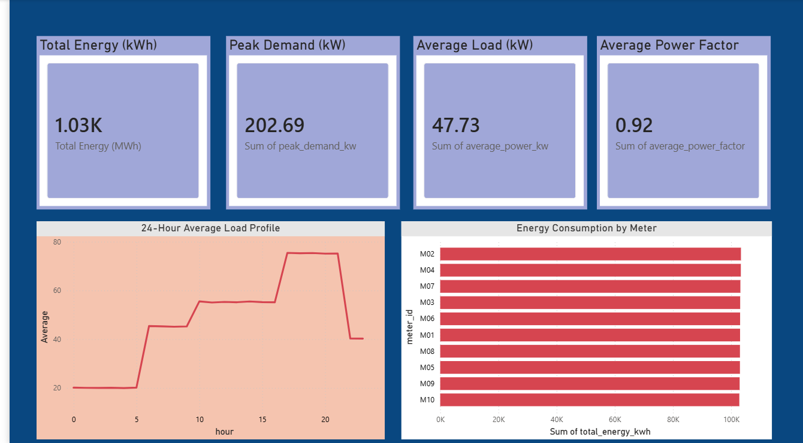
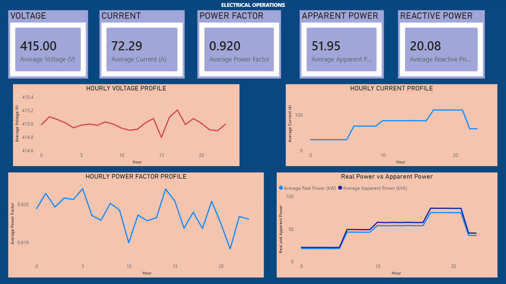
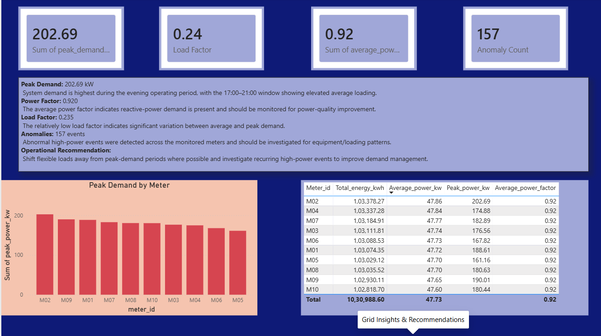

# ⚡ PowerGrid Energy Analytics & Electrical Operations Dashboard

An end-to-end electrical energy analytics project combining **Python, SQL, MATLAB and Power BI** to analyze energy consumption, electrical operating parameters, peak demand and abnormal power events across multiple meters.

---

## 📊 Project Overview

This project analyzes **86,400 electrical measurements across 10 meters** and converts raw electrical measurements into actionable energy and grid-operation insights.

The project combines:

- Python-based data generation and analytics
- SQL-based energy and meter analysis
- MATLAB-based electrical engineering calculations
- Power BI-based interactive visualization
- Anomaly detection for high-power events

### Key Results

| Metric | Result |
|---|---:|
| Electrical Measurements | 86,400 |
| Monitored Meters | 10 |
| Total Energy | 1,030,988.61 kWh |
| Average Power | 47.73 kW |
| Peak Demand | 202.69 kW |
| Average Power Factor | 0.920 |
| Load Factor | 0.235 |
| Detected Anomalies | 157 |

---

# 🏗️ Project Architecture

```text
Raw Electrical Data
        │
        ▼
     Python
  Data Generation
  Data Analysis
        │
        ├───────────────┐
        ▼               ▼
      SQL            MATLAB
   Analytics       Electrical
   & Queries       Calculations
        │               │
        └───────┬───────┘
                ▼
            Power BI
        Interactive Dashboard
                │
                ▼
      Grid & Operational Insights


---

## 📊 Power BI Dashboard

The Power BI dashboard provides interactive analysis of electrical energy consumption, operating parameters, meter performance, peak demand, load factor, power factor, and abnormal power events.

### Executive Energy Overview



### Electrical Operations



### Anomaly & Power Quality


### Grid Insights & Recommendations



---

## ⚡ MATLAB Electrical Analysis

MATLAB was used to perform electrical engineering calculations and validate the operating characteristics of the monitored electrical system.

The analysis includes:

- Average voltage
- Average current
- Average real power
- Apparent power
- Reactive power
- Power factor
- Maximum current
- Peak load
- Load factor
- Electrical calculation validation

### MATLAB Results


### 24-Hour Load Profile


### Hourly Power Factor


### Hourly Reactive Power


### Hourly Current


---

## 🔄 Project Workflow

```text
Electrical Measurement Data
          ↓
   Python Data Analysis
          ↓
      SQLite Database
          ↓
      SQL Analysis
          ↓
 MATLAB Electrical Analysis
          ↓
     Power BI Dashboard
          ↓
 Energy & Grid Insights
